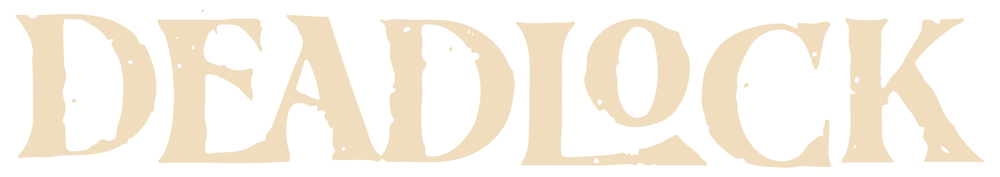

<div align="center">
  
  
  <p><strong>A modern mod manager for Deadlock</strong></p>
  
  <p>
    
    
    
    
  </p>
  <p>
    
    
  </p>
</div>

---

Browse GameBanana, manage VPK mods, customize crosshairs, track your stats, and organize your setup with profiles — all from one app.

## Table of Contents

- [Features](#features)
- [Installation](#installation)
- [Development](#development)
- [Project Structure](#project-structure)
- [Contributing](#contributing)
- [License](#license)
- [Acknowledgments](#acknowledgments)

## Features

### 🎮 Browse & Download
Search and download mods directly from GameBanana with intelligent caching. Preview images, read descriptions, and install with one click.

### 📦 Mod Management
Enable, disable, and prioritize your mods. Automatic conflict detection shows when mods override the same files, letting you choose which takes priority.

### 🦸 Hero Locker
View and organize skins by hero. See all available skins for each character and manage your collection visually.

### 🎯 Crosshair Designer
Create custom crosshairs with a live preview that matches in-game rendering. Save presets and export to your autoexec.

### 📊 Stats Dashboard
Track your performance with data from the Deadlock Stats API. View hero analytics, leaderboards, and meta insights.

### 📝 Autoexec Manager
Configure console commands with categorized presets. Manage launch options without editing files manually.

### 💾 Profiles
Save and restore complete mod configurations. Switch between different setups for ranked, casual, or streaming.

## Installation

### Pre-built Releases

Download the latest release for your platform from [Releases](../../releases):

| Platform | Formats |
|----------|---------|
| **Windows** | `.exe` installer, portable |
| **Linux** | `.AppImage`, `.deb` |
| **macOS** | `.dmg` |

### Requirements

- **Deadlock** installed via Steam
- **7-Zip** installed for extracting archives (Linux/macOS)

## Development

### Prerequisites

- [Node.js](https://nodejs.org/) 20+
- [pnpm](https://pnpm.io/) 9+

### Setup

```bash
# Clone the repository
git clone https://github.com/Slush97/modmanager.git
cd modmanager

# Install dependencies
pnpm install

# Start development server
pnpm dev
```

### Build

```bash
# Build for your platform
pnpm package:linux   # Linux: AppImage, deb
pnpm package:win     # Windows: NSIS installer, portable
pnpm package:mac     # macOS: DMG
```

## Project Structure

```
├── electron/           # Electron main process
│   ├── main/
│   │   ├── ipc/        # IPC handlers
│   │   └── services/   # Backend services (mods, downloads, stats)
│   └── preload/        # Preload scripts
├── src/                # React frontend
│   ├── components/     # UI components
│   ├── pages/          # Page components
│   ├── hooks/          # Custom React hooks
│   └── stores/         # Zustand state stores
├── public/             # Static assets
│   └── branding/       # Logo and wordmarks
└── docs/               # Documentation
    └── database/       # Database schema docs
```

## Contributing

Contributions are welcome! Please read the [Contributing Guide](CONTRIBUTING.md) for details on the development process and how to submit pull requests.

## License

This project is licensed under the MIT License — see the [LICENSE](LICENSE) file for details.

## Acknowledgments

- [GameBanana](https://gamebanana.com/) for the mod hosting platform and API
- [Deadlock Stats API](https://docs.deadlock-api.com/) for player statistics
- [Valve](https://www.valvesoftware.com/) for Deadlock
- The modding community for creating amazing content
