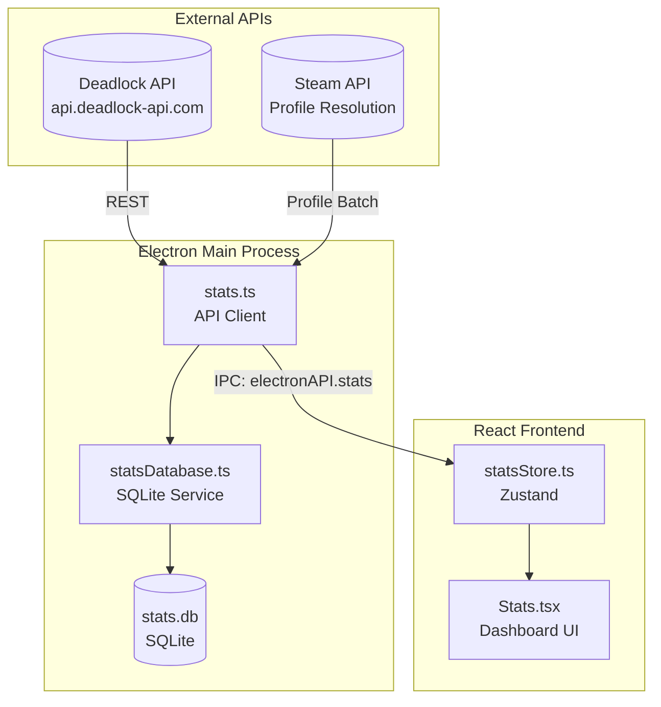
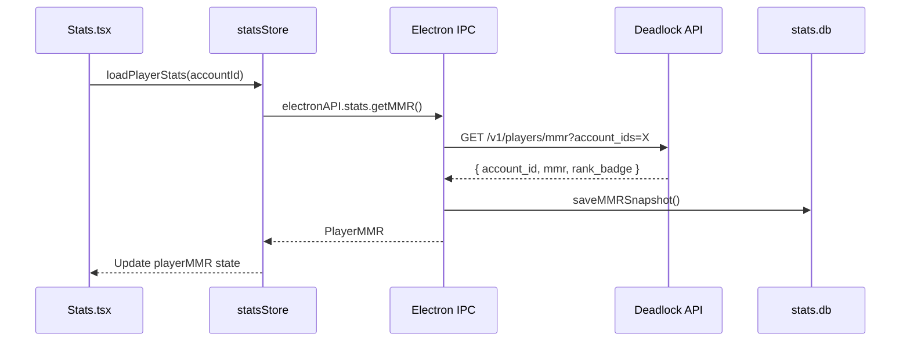

# Deadlock Stats API & Database Architecture

> Comprehensive reference for the Deadlock Mod Manager's player statistics system, covering external API integration, local persistence, and data flow patterns.

---

## System Overview



---

## Database Schema (stats.db)

### Entity Relationship Diagram

```mermaid
erDiagram
    players ||--o{ mmr_snapshots : "has"
    players ||--o{ match_history : "has"
    players ||--o{ hero_stats_snapshots : "has"
    players ||--|| aggregated_stats : "has"

    players {
        INTEGER account_id PK
        TEXT steam_id
        TEXT persona_name
        TEXT avatar_url
        INTEGER is_primary
        INTEGER added_at
        INTEGER last_updated
    }

    mmr_snapshots {
        INTEGER id PK
        INTEGER account_id FK
        INTEGER mmr
        INTEGER rank
        INTEGER rank_badge
        TEXT rank_tier
        TEXT snapshot_date UK
        INTEGER created_at
    }

    match_history {
        INTEGER match_id PK
        INTEGER account_id PK_FK
        INTEGER hero_id
        TEXT hero_name
        INTEGER start_time
        INTEGER duration_s
        INTEGER game_mode
        TEXT match_outcome
        TEXT player_team
        INTEGER kills
        INTEGER deaths
        INTEGER assists
        INTEGER last_hits
        INTEGER denies
        INTEGER net_worth
        INTEGER player_damage
        INTEGER player_healing
        INTEGER obj_damage
        TEXT items
        INTEGER fetched_at
    }

    hero_stats_snapshots {
        INTEGER id PK
        INTEGER account_id FK
        INTEGER hero_id
        TEXT hero_name
        INTEGER matches_played
        INTEGER wins
        INTEGER losses
        INTEGER total_kills
        INTEGER total_deaths
        INTEGER total_assists
        REAL avg_damage
        REAL avg_healing
        TEXT snapshot_date UK
    }

    aggregated_stats {
        INTEGER account_id PK_FK
        INTEGER total_matches
        INTEGER total_wins
        INTEGER total_losses
        INTEGER total_kills
        INTEGER total_deaths
        INTEGER total_assists
        INTEGER current_win_streak
        INTEGER best_win_streak
        INTEGER current_loss_streak
        INTEGER worst_loss_streak
        INTEGER last_match_id
        INTEGER last_updated
    }

    stats_settings {
        TEXT key PK
        TEXT value
    }
```

### Table Purposes

| Table | Purpose | Cardinality |
|-------|---------|-------------|
| `players` | Registry of tracked Steam accounts | 1 primary + N tracked |
| `mmr_snapshots` | Daily MMR/rank history for charting | 1 per player per day |
| `match_history` | Complete game records with stats | N matches per player |
| `hero_stats_snapshots` | Per-hero performance over time | N heroes × M snapshots |
| `aggregated_stats` | Computed lifetime stats + streaks | 1 per player |
| `stats_settings` | Key-value config storage | N settings |

### Indexes

| Index | Table | Columns | Purpose |
|-------|-------|---------|---------|
| `idx_mmr_snapshots_account` | mmr_snapshots | account_id, snapshot_date DESC | Fast MMR history lookup |
| `idx_match_history_account` | match_history | account_id, start_time DESC | Recent matches query |
| `idx_match_history_hero` | match_history | account_id, hero_id | Per-hero match filtering |
| `idx_hero_stats_account` | hero_stats_snapshots | account_id, snapshot_date DESC | Hero trend analysis |

---

## API Endpoints & Data Flow

### Player Data Pipeline



### API Endpoint Reference

| Endpoint | Data Fetched | DB Table | Transform |
|----------|--------------|----------|-----------|
| `/v1/players/mmr` | Current MMR/rank | mmr_snapshots | Daily dedupe |
| `/v1/players/{id}/match-history` | Match records | match_history | ON CONFLICT ignore |
| `/v1/players/hero-stats` | Per-hero stats | hero_stats_snapshots | Weekly snapshot |
| `/v1/players/steam` | Profile data | players | Name/avatar update |
| `/v1/players/{id}/mate-stats` | Teammate win rates | — | In-memory only |
| `/v1/players/{id}/enemy-stats` | Opponent stats | — | In-memory only |
| `/v1/analytics/badge-distribution` | Rank distribution | — | Transform badge_level→names |
| `/v1/analytics/hero-counter-stats` | Hero matchups | — | Transform field names |
| `/v1/analytics/hero-synergy-stats` | Hero pairs | — | Transform hero_id1/2 |

### Meta Analytics Transform Layer

Several analytics endpoints require backend transformation:

```typescript
// Badge Distribution: badge_level 12-116 → Initiate I through Eternus VI
const group = Math.floor(badgeLevel / 10)  // 1-11
const sublevel = badgeLevel % 10           // 2-6 → I-V

// Hero Counters: API field mapping
{ hero_id, enemy_hero_id, matches_played, wins }
  → { hero_id, enemy_hero_id, matches, win_rate }

// Hero Synergies: API field mapping  
{ hero_id1, hero_id2, matches_played, wins }
  → { hero_id, ally_hero_id, matches, win_rate }
```

---

## Rank System Reference

### Badge Level Mapping

| Group | Badge Levels | Rank Name | Color |
|-------|--------------|-----------|-------|
| 1 | 12-16 | Initiate I-V | Silver |
| 2 | 21-26 | Seeker I-VI | Bronze |
| 3 | 31-36 | Alchemist I-VI | Gold |
| 4 | 41-46 | Arcanist I-VI | Green |
| 5 | 51-56 | Ritualist I-VI | Cyan |
| 6 | 61-66 | Emissary I-VI | Blue |
| 7 | 71-76 | Archon I-VI | Purple |
| 8 | 81-86 | Oracle I-VI | Pink |
| 9 | 91-96 | Phantom I-VI | Red |
| 10 | 101-106 | Ascendant I-VI | Orange |
| 11 | 111-116 | Eternus I-VI | Gold |

> **Note**: Obscurus (Unranked) is not returned by the badge-distribution endpoint.

---

## Experimental Hero Filtering

Heroes in active development ("Hero Labs") are excluded from analytics:

```typescript
export const EXPERIMENTAL_HERO_IDS = new Set([52, 66, 68, 69, 72])
// 52: Wrecker, 66: Fathom, 68: Trapper, 69: Raven, 72: The Warden
```

Applied to: Hero Counters, Hero Synergies, Hero Duos, Heroes tab, Analytics tab.

---

## Key Implementation Patterns

### 1. Fetch-then-Persist
Load local data immediately → background API fetch → persist new data → update UI.

### 2. Batch Profile Resolution
Collect unique player IDs → single Steam API call → map back to entities.

### 3. Sort-Before-Slice
Sort by UI display order **before** slicing IDs for batch lookup to ensure displayed entries have resolved names.

### 4. Incremental Sync
Use `MAX(match_id)` as cursor for `min_match_id` parameter to avoid re-fetching old matches.

---

## Future Suggestions

### Documentation Improvements
- [ ] Add GameBanana API schema documentation (separate file)
- [ ] Create visual IPC namespace mapping diagram
- [ ] Document rate limiting strategy for Steam API
- [ ] Add error handling flow diagrams

### Database Enhancements
- [ ] Consider adding `match_participants` table for teammate/enemy history
- [ ] Add `build_history` table for tracking player builds over time
- [ ] Implement database schema versioning with migrations table
- [ ] Add composite indexes for complex queries (e.g., hero+outcome)

### API Integration
- [ ] Cache analytics endpoints with TTL (badge-distribution, counter-stats)
- [ ] Implement retry logic with exponential backoff
- [ ] Add request deduplication for concurrent calls
- [ ] Create item name mapping (currently missing from API)

### UI/UX
- [ ] Add data freshness indicators (last sync timestamp)
- [ ] Implement offline mode with cached data
- [ ] Add export functionality (CSV/JSON) for match history
- [ ] Create shareable stat cards for social media

---

*Last Updated: 2026-01-03*
